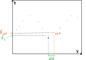

En este documento se presenta el tratamiento utilizado para obtener los resultados presentados en el póster defendido en el 18 congreso colombiano de química.

Primero, se importa una matriz de los espectros promediadios:

```{r}
m <- read.table("matrizbien.txt")
```

El objeto `m` contiene en la segunda columna el índice de posición (el número de fila) que no vamos a utilizar para el análisis. por esto, lo retiramos:

```{r}
m2 <- m[,-2]
```

En la matriz `m2` tenemos las muestras en las columnas, y las absorbancias en las filas. Con el objetivo de tener las variables en las columnas, y las muestras en las filas, calculamos la matriz traspuesta con la función `t()`.

```{r}
mt <- t(m2)
```

En este momento, la fila 1 de la matriz traspuesta `mt` contiene los nombres de las columnas, para utilizar esta información de la manera adecuada, extraemos de la fila 1 los números de onda y los asignamos a los nombres de las columnas de `mt` con la función `colnames()`

```{r}
colnames(mt) <- as.character(unlist(mt[1,]))
```

Ahora, no necesitamos la primera columna que contiene los nombres de las columnas. entonces, la eliminamos.

```{r}
mt2<- mt[-1,]
```


En todos los espectros, al final hay una señal de cero absorbancia. esto hace que la columna `1869` esté llena de ceros, lo que no permite la ejecución del análisis multivariado.

```{r}
mt3 <- mt2 [,-1869]
```

## Calculo de derivadas mediante diferenciación numérica.

Para el calculo de la derivada utilizamos el método de diferenciación numérica `fordward differentiation` el cual se basa en  la definición de una función como su expansión en una serie de Taylor del tipo:

\begin{align}
f(x) = f(\bar{x}) + f'(\bar{x})\Delta x + f''(\bar{x})\frac{\Delta x^2}{2!} + f'''(\bar{x}) \frac{\Delta x^3}{3!} + O(\Delta x ^4)
\end{align}

En donde $x$ es la variable independiente y $\bar{x}$ es un valor que toma esta variable.


Esta aproximación se utiliza cuando se tienen conjuntos de puntos, y no funciones bien definidas para encontrar su derivada.

Teniendo en cuenta dos puntos, $x_i$ y $x_{i+1}$ como en el siguiente diagrama, se puede definir la función evaluada en dichos puntos como $f(x_i)$ y $f(x_{i+1})$ respectivamente:


 Para el siguiente razonamiento consideraremos a $f_i$ como la función $f(x)$ evaluada en $x_i$, $f_i = f(x_i)$, de manera análoga para el punto inmediatamente siguiente, $f_{i+1} = f(x _ {i+1})$.

\begin{align}
f_{i+1} = f_i + f'_i \Delta x + f''_i \frac{\Delta x^2}{2!} + f''' \frac{\Delta x ^3}{3 !} + O(\Delta x^4)
\end{align}


En donde podemos resolver para $f'_i$:

\begin{align}

f'_i = - \frac{f_i}{\Delta x} + \frac{f_{i+1}}{\Delta x} - f''_i \frac{\Delta x}{2 !} - f'''_i \frac{\Delta x^2}{6!} - O(\Delta x ^3) 
\end{align}

 reordenando:

\begin{align}

f'_i =( \frac{f_{i+1} - f_i}{\Delta x}) \; - \; (- f''_i \frac{\Delta x}{2 !} - \cdot \cdot \cdot)
\end{align}

En donde lo contenido en el primer paréntesis,  $\frac{f_{i+1} - f_i}{\Delta x}$ es lo que podemos calcular numéricamente, y lo contenido en el segundo paréntesis es el error de aproximación que tiene una relación inversa con la magnitud de $\Delta x$.

Para realizar las operaciones por columnas, trasponemos de nuevo la matriz `m3`, para tener cada espectro en una columna.

```{r}
m3 <- t(mt3)
```

Luego extraemos un vector con el valor de $x$, la variable independiente que en este caso es la frecuencia de la luz incidente en número de onda.

```{r}
wn <- as.numeric(rownames(m3))
```

Luego, cremos la matriz `wn2`
para guardar en su primera columna los valores de $x$:

```{r}
wn2 <- matrix(, nrow=1868, ncol=1)
```

En el script original, utilizamos un ciclo para llenar posición por posición,  en las lineas `15` a `24`. Esto no es necesario y puede hacerse mediante una orden:


